  

  <strong>Hey, I'm Aakash 👋</strong> 
  I turn ideas into interfaces, APIs, and useful developer tools.

  <a href="https://github.com/younameit01?tab=repositories">🧑‍💻 Explore my code</a>
  &nbsp; • &nbsp;
  <a href="https://github.com/younameit01/macpulse">⚡ Check out MacPulse</a>

  
  

<!-- Technology logos from Devicon (MIT). See assets/DEVICON-LICENSE.txt. Project illustrations are decorative, not screenshots or live metrics. -->
